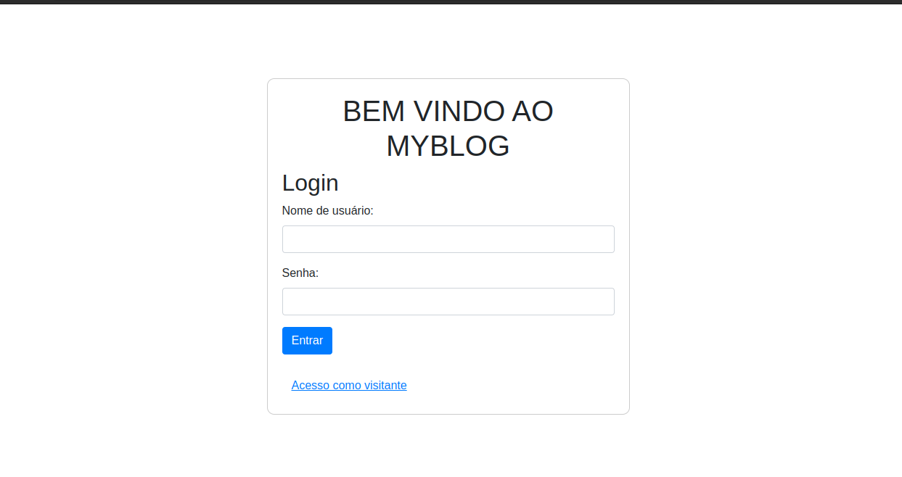

# SISTEMA DE BLOGS

**O que estamos usando:**
- PHP 8.1
- Mysql 8.0.33
- Nginx

**Como executar:**
- É necessario ter o docker instalado
- Tendo o docker instalado, basta rodar o seguinte comando:
- _docker-compose up -d_
- Vai instar todas as dependencias, e após isso, basta acessar ao localhost/
Pagina Inicial:
- 
- Ali teremos uma opção de acessar como admin:
  - user: admin
  - password: admin
- ou tambem pode acessar como guest.

**Descrição dos usuarios:**
- Admin (1):  O usuario admin pode alterar todos os posts, e criar novos usuarios no painel administrativo
- Usuario comum (2): Pode acessar o site com login e senha, criar novos posts, e editar somente o seu post
- Guest/Visitante (0): Pode acessar o blog, e publicar novos posts, porem não pode editar.

Segue um print do site em modo admin:

O DUMP do banco de dados está incluso na pasta mydb.